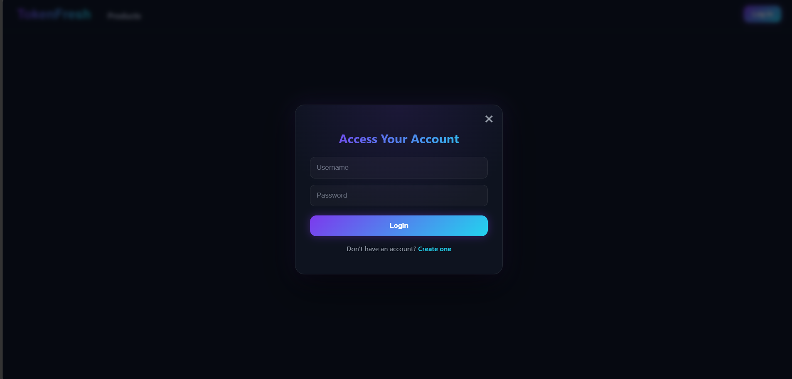
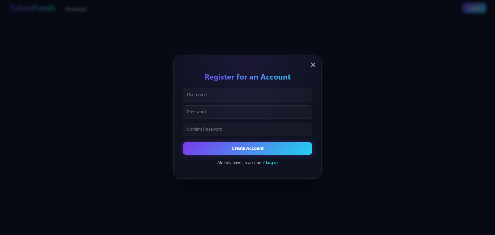
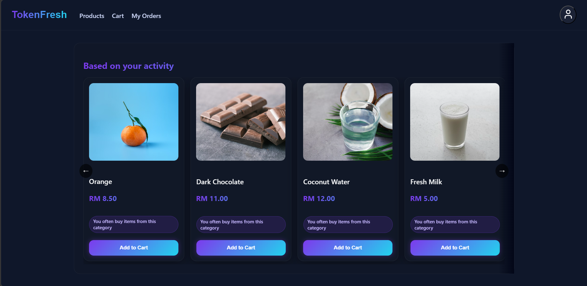
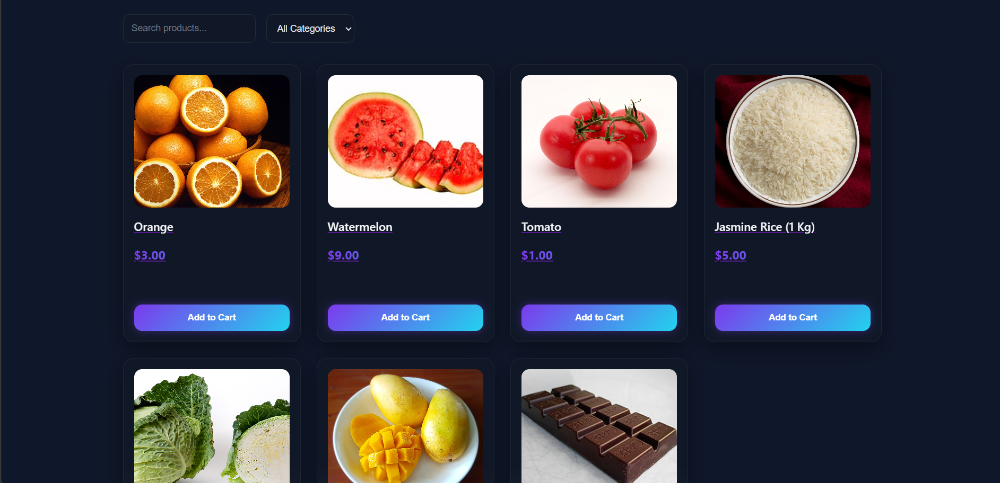
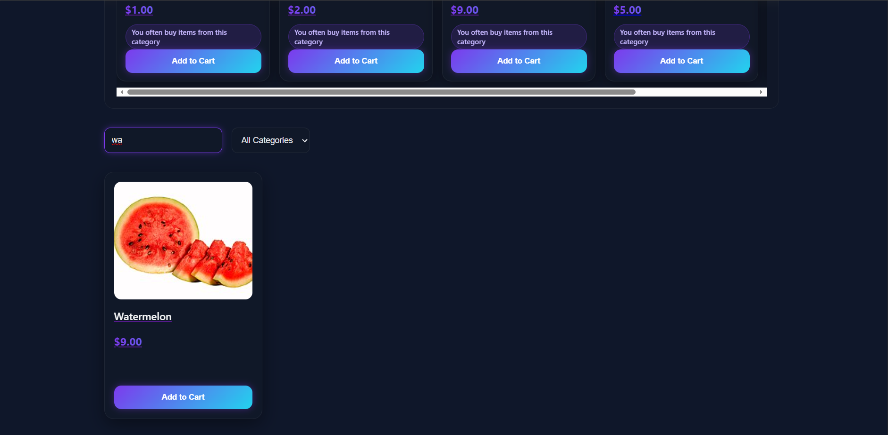
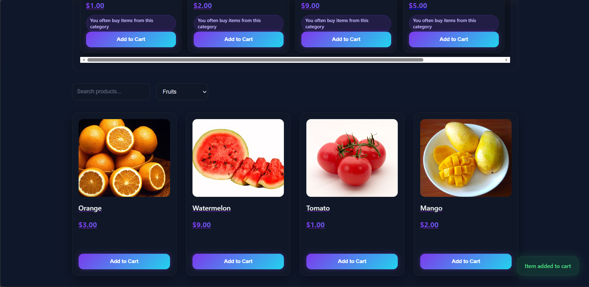
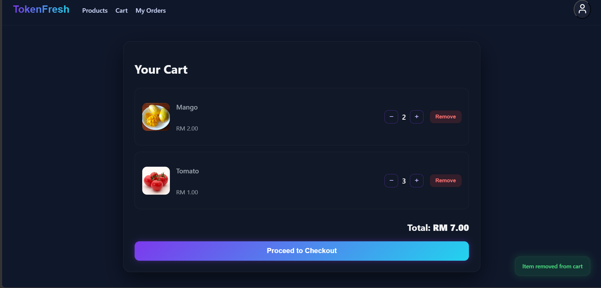
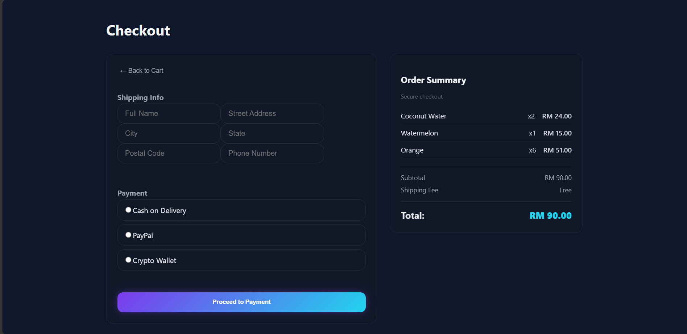

# TokenFresh

A full-stack eCommerce web application that allows users to browse groceries, place orders, and manage their account. Admins can handle inventory, track orders, and generate reports — all in one system.

## Features

### User Functions

* **Registration & Login** – Users must register and login to access the platform.
* **Browse Products** – Search for groceries by category or product name.
* **View Product Details** – See product information, pricing, and availability.
* **Add to Cart** – Add items to a shopping cart and proceed to checkout.
* **Place Order** – Complete orders by providing shipping and payment details.

### Admin Functions

* **Manage Inventory** – Add, update, or remove products, including pricing and stock levels.
* **Manage Orders** – View incoming orders and track their status.
* **Generate Reports** – Generate product sales reports to analyze performance.
* **Manage Customers** – Track customer orders and manage user accounts.

## Screenshots











## Tech Stack

* **Frontend:** React, CSS (custom design)
* **Backend:** Django + Django REST Framework
* **Database:** SQLite
* **Authentication:** Session-based authentication

## Project Structure

```
react-dramas/   # React frontend
myapp/          # Django REST API backend
```
